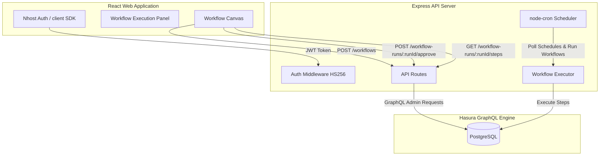

# AI Agent Workflow Builder

A premium, interactive web application and backend execution engine for constructing, scheduling, and running automated multi-step AI agent workflows.

---

## 🚀 Key Features

*   **Visual Workflow Canvas**: Dynamically build sequential pipelines using specialized agent cards (LLM Call, HTTP Request, Conditional Branch, Approval Gate, DB Write, Notify).
*   **Interactive Approval Gates**: Pause executions mid-run at approval cards, monitor the paused status, and resume the exact execution flow using secure admin approval actions.
*   **Real-time Status Polling**: Continuous, resource-efficient synchronization of active runs to update UI cards and display detailed logs dynamically.
*   **Background Webhook Triggers**: Public endpoint (`POST /api/workflows/:id/webhook`) to execute workflows asynchronously in the background from external integrations.
*   **Hasura Actions Integration**: Custom action adapter handler (`POST /api/actions/triggerWorkflowRun`) compatible with Hasura's action specifications.
*   **Dynamic Scheduler Daemon**: Background scheduler service utilizing `node-cron` to fetch and execute `"scheduled"` type workflow triggers automatically based on cron expressions.
*   **Usage Quotas**: Organization-wide quotas that check limits before starting execution, block runs if exceeded, and increment usage counts upon successful workflow completion.

---

## 🏗️ Architecture



---

## 🛠️ Step Types

1.  **🤖 LLM Call**: Prompts an LLM with custom configs to generate AI responses.
2.  **🌐 HTTP Request**: Calls external REST APIs (GET, POST, PUT, DELETE) to fetch or push payload data.
3.  **🔀 Conditional Branch**: Short-circuits workflow execution or forks paths based on matching criteria (e.g., `"response is not empty"`).
4.  **👤 Approval Gate**: Safely halts execution, updating status fields to `"paused"`, awaiting owner or editor approval before proceeding.
5.  **💾 DB Write**: Automatically saves outputs to the `workflow_data` table.
6.  **🔔 Notify**: Dispatches structured execution alerts and logs payloads to console streams.

---

## ⚙️ Environment Variables

### Backend (`/backend/.env`)

```ini
NHOST_GRAPHQL_URL=https://<your-subdomain>.graphql.<your-region>.nhost.run/v1
NHOST_AUTH_URL=https://<your-subdomain>.auth.<your-region>.nhost.run/v1
NHOST_SUBDOMAIN=<your-subdomain>
NHOST_REGION=<your-region>
NHOST_ADMIN_SECRET=<your-hasura-admin-secret>
NHOST_JWT_SECRET=<your-nhost-jwt-secret>
PORT=5001
```

### Frontend (`/frontend/.env`)

```ini
VITE_HASURA_WS_URL=wss://<your-subdomain>.graphql.<your-region>.nhost.run/v1/graphql
```

---

## 📦 Getting Started

### 1. Prerequisites
Make sure you have [Node.js](https://nodejs.org/) installed on your machine.

### 2. Install Dependencies

In the project root:

```bash
# Install backend packages
cd backend
npm install

# Install frontend packages
cd ../frontend
npm install
```

### 3. Start Development Servers

Start both servers in parallel:

```bash
# Run backend (Server will run on http://localhost:5001)
cd backend
npm run dev

# Run frontend (Vite dev server will launch)
cd ../frontend
npm run dev
```

---

## 📡 API Reference

### Workflows

*   `POST /api/workflows`
    *   **Auth**: Required (Owner or Editor)
    *   **Description**: Creates a new workflow and registers its sequential steps in PostgreSQL.
*   `POST /api/workflows/:id/start`
    *   **Auth**: Required
    *   **Description**: Initiates a workflow run, validates organization call quotas, and executes steps.
*   `POST /api/workflows/:id/webhook`
    *   **Auth**: Public
    *   **Description**: Triggers execution asynchronously in the background. Useful for webhook integrations (e.g. Stripe, GitHub).

### Resumption & Monitoring

*   `POST /api/workflow-runs/:runId/approve`
    *   **Auth**: Required (Owner or Editor)
    *   **Description**: Approves a paused step, updates step-run status to `"completed"`, records approval metadata, and resumes execution from the next step.
*   `GET /api/workflow-runs/:runId/steps`
    *   **Auth**: Required
    *   **Description**: Fetches execution logs, workflow statuses, and individual step runs.

### Hasura Action Adapter

*   `POST /api/actions/triggerWorkflowRun`
    *   **Auth**: Bearer Token forwarding
    *   **Description**: Proxies Hasura Action calls to the start handler. Expects `workflow_id` in the input payload.
